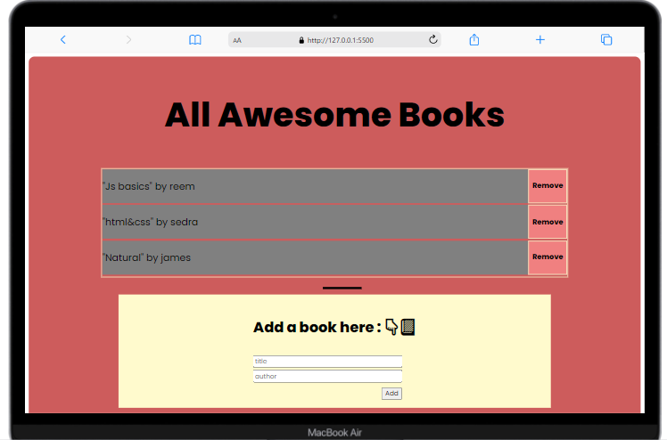

<!-- Feel Free to Add, Update, Delete Any Section you find needs so -->

# AwesomeBooks

> .This project is BookStore so the user can add books by just enter Book name and the author After the user add it,
it already displayed in the top of the page and can remove it by remove button.

## Built With

- Languages: _**HTML, CSS, JavaScript**_
- Frameworks: _**N/A**_
- Technologies used: _**GIT, GITHUB, LINTERS**_

## Additional tools
 - Google fonts

## Live Demo

[See My project Live here]()

## Authors

<!-- Only Change Username for Different Accounts -->

👤 **Reem**

 Platform | Badge |
 --- | --- |
 **GitHub**  | [@Reem-lab](https://github.com/Reem-lab)
 **Twitter** | [Rem79940127](https://twitter.com/Rem79940127)
 **LinkdIn** | [reem-janina](https://www.linkedin.com/in/reem-janina-ab74ab21a/)

 👤 **Fernando**

 Platform | Badge |
 --- | --- |
 **GitHub**  | [@fherrerao](https://github.com/fherrerao)
 **Twitter** | [fherrera0206](https://twitter.com/fherrera0206)
 **LinkdIn** | [Fernando-Herrera](https://www.linkedin.com/in/fernando-herrera-25a6361b2/)

## 🤝 Contributing

Contributions, issues, and feature requests are welcome!

Feel free to check the [issues page](https://github.com/MrRamoun/WEBDEV/issues).

## Show your support

Give a ⭐️ if you like this project!

## Acknowledgments

- Hat tip to anyone whose code was used
- Inspiration
- etc

## 📝 License

This project is [MIT](/LICENSE) licensed.
